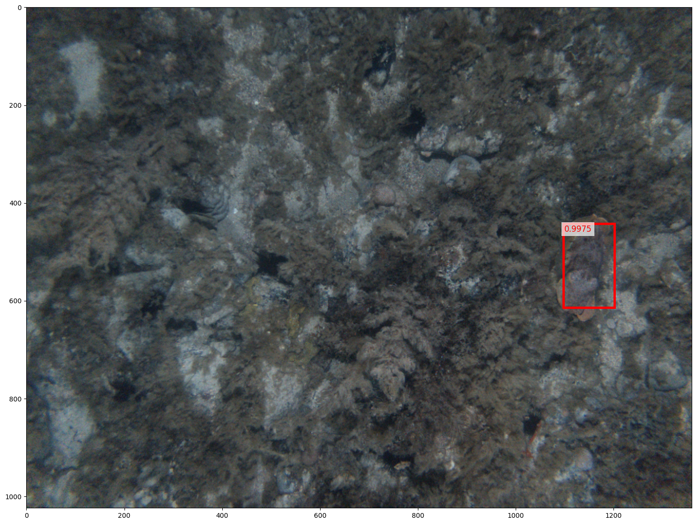
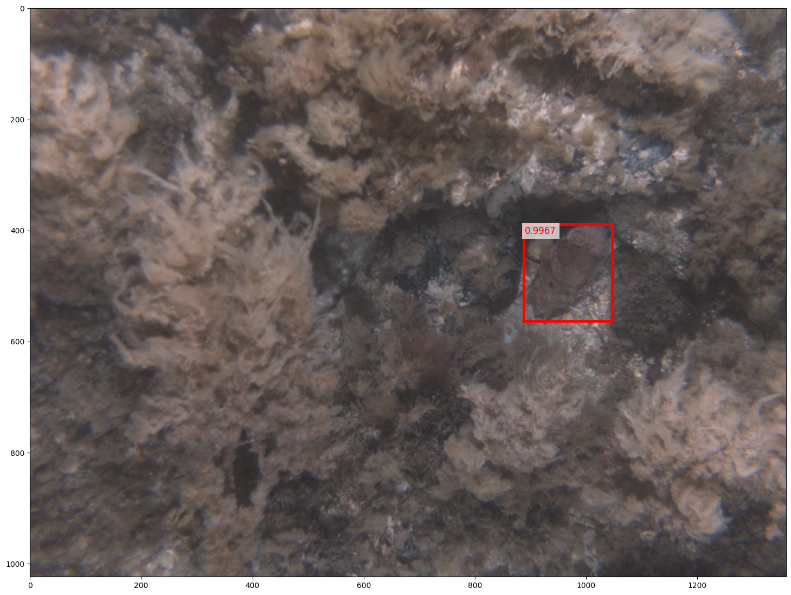
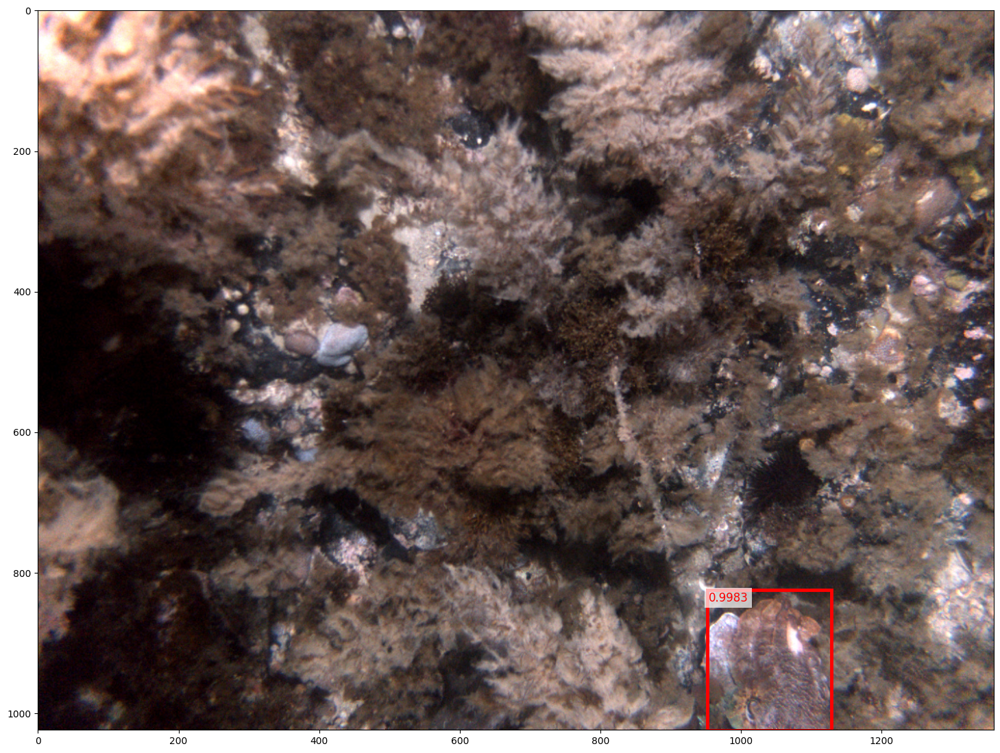
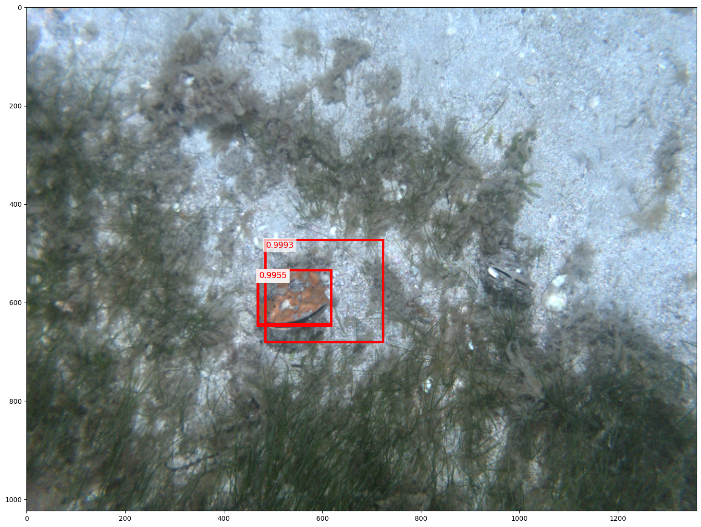
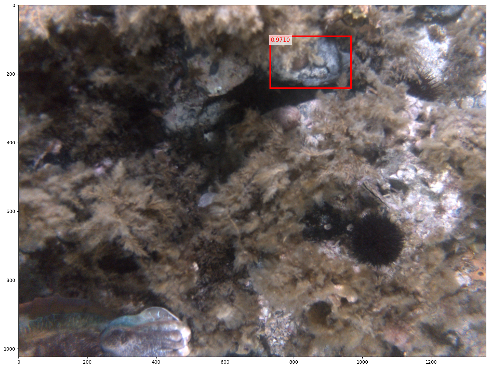

# marine-life-detector
Still very much a WIP.

TODOs:
- Increase speed by using Faster-RCNN or YOLO
- Improve accuracy by trying some other pretrained models

Implementation of a region based convolutional neural network (R-CNN) to detect and localise a particular species in images taken in AUV surveys. Initially designed for detection of cuttlefish in images.

Given a set of annotated images of target species, a CNN is trained by running `train_cnn.py`. This CNN can distinguish whether or not an input image is the target species or not. Architecture of CNN can be modified by changing `CNN_model.py`. 

The CNN can then be fine tuned by running `fine_tune_cnn.py` to better distinguish whether outputs of selective search algorithm (i.e. imperfect bounding boxes) do indeed contain parts of a target species or not. Model can then be run on new images to find and localise target species by using `run_rcnn.ipynb`.

### True Positive Examples (with cuttlefish)

### False Positive Examples (with cuttlefish)

`show_images.py` also contains some utility functions for adding annotations and modifying them

Created as part of my 2020 winter research project with the marine robotics group at the Australian Centre for Field Robotics Marine Robotics.
